# Join Saving Smart Contract

# Introduction

This document describes the testing process and the steps in order to test the smart contract implemented to maintain join saving accounts. 

> The following accounts has been used for this contract testing. 
> Account 1: 0x0c0669Cd5e60a6F4b8ce437E4a4A007093D368Cb and Account 2: 0x7A1f3dFAa0a4a19844B606CD6e91d693083B12c0
## Compiling the code

The following screenshot shows the output of the Remix editor after the code has been compiled successfully.

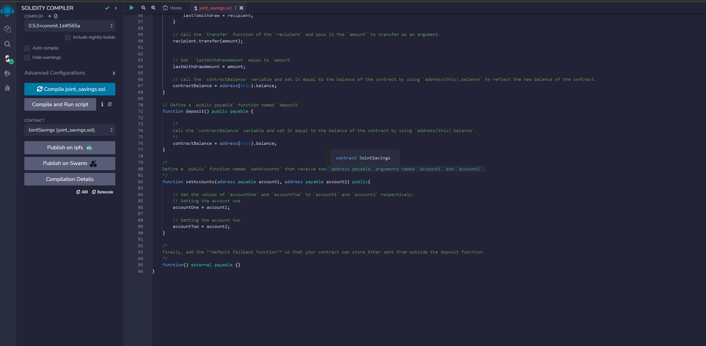

## Deployment

The following images shows the screen of the after the deployment.

### Deployment success log message

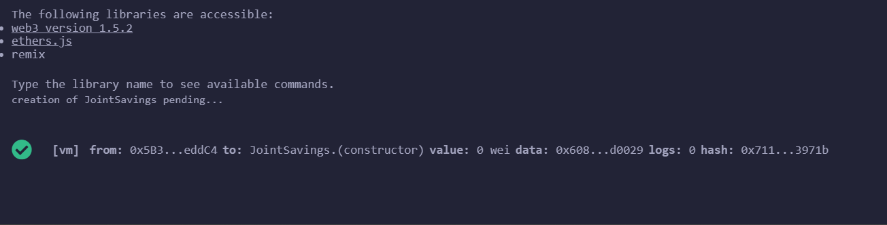

### Deployment success screen

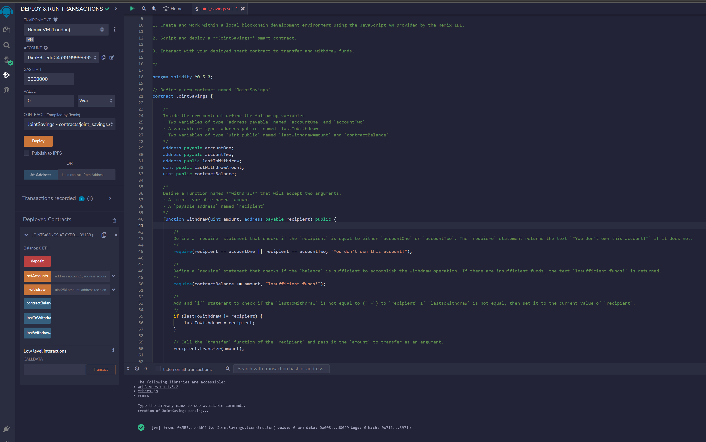

## Set Accounts

The following image shows the screenshot after set account function call.

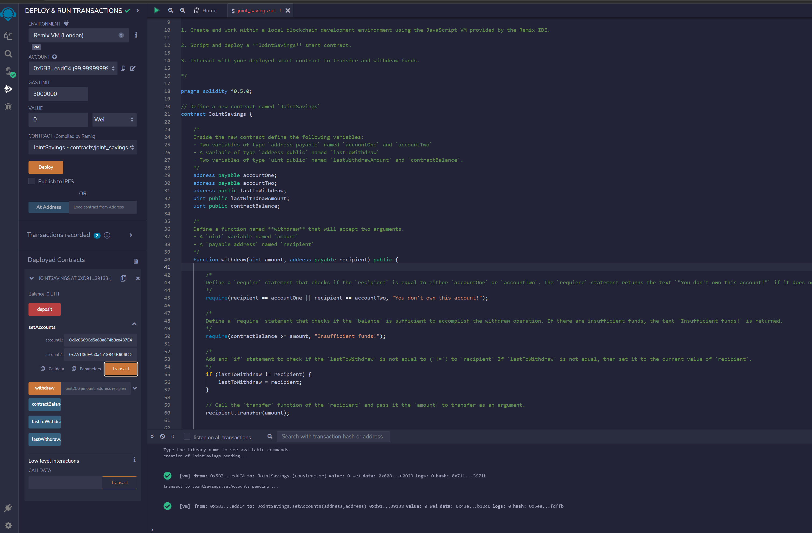

## Deposit

The following image shows the screen of deposit steps.

### 1 Ether deposit started.

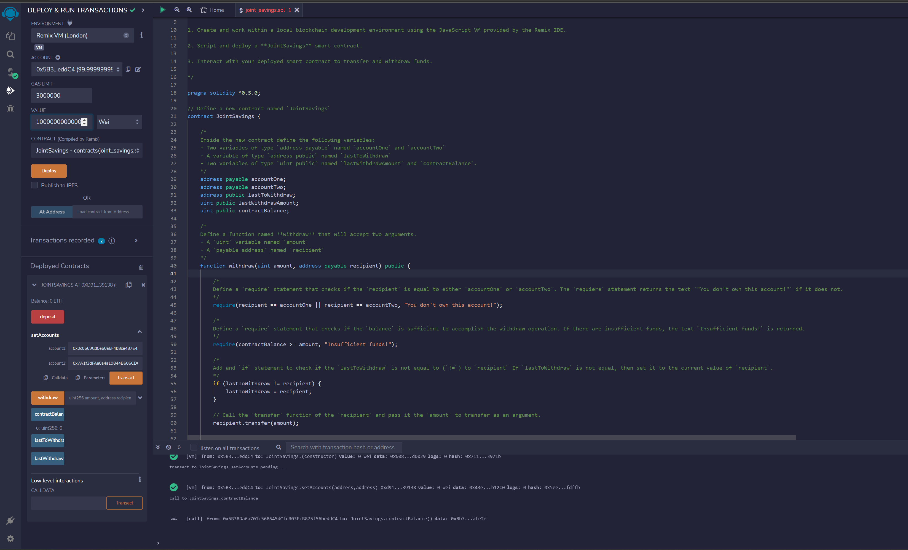

### 1 Ether deposit completed successfully.

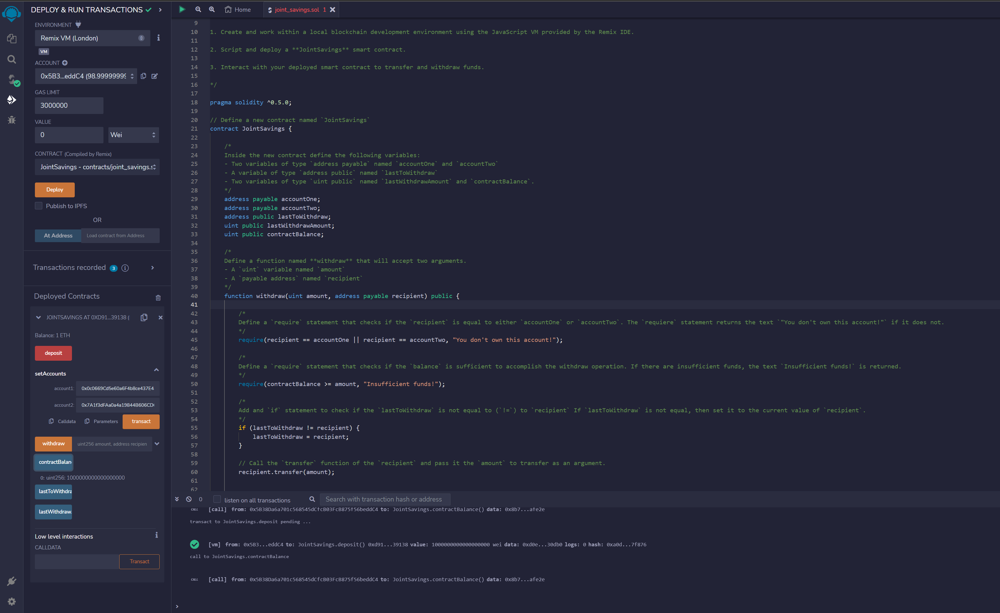

### 10 Ether deposit started

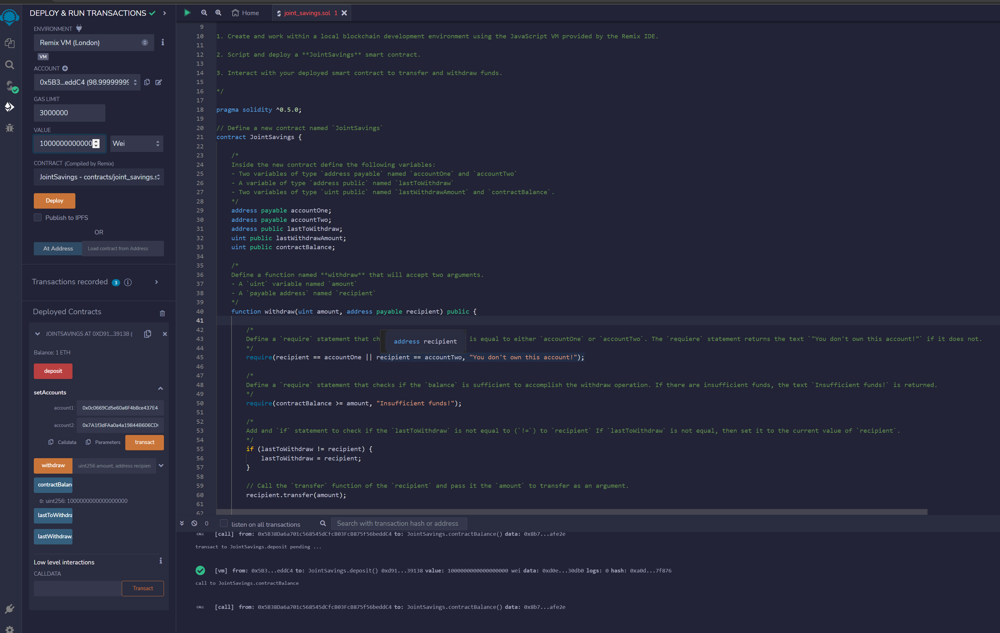

### 10 Ether deposit completed successfully

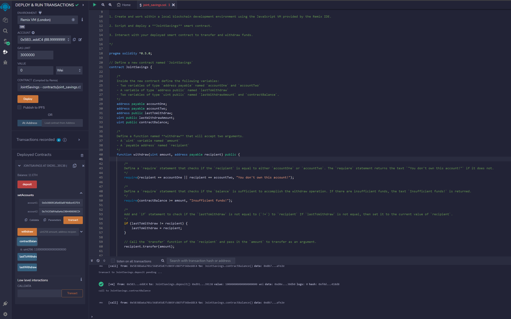

### 5 Ether deposit started

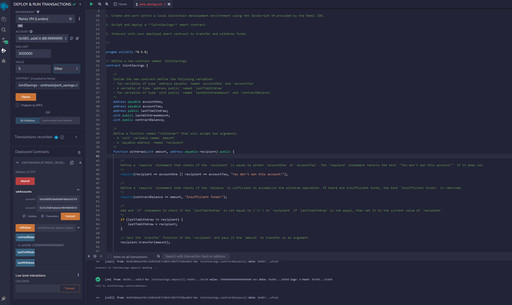

### 5 Ether deposit completed

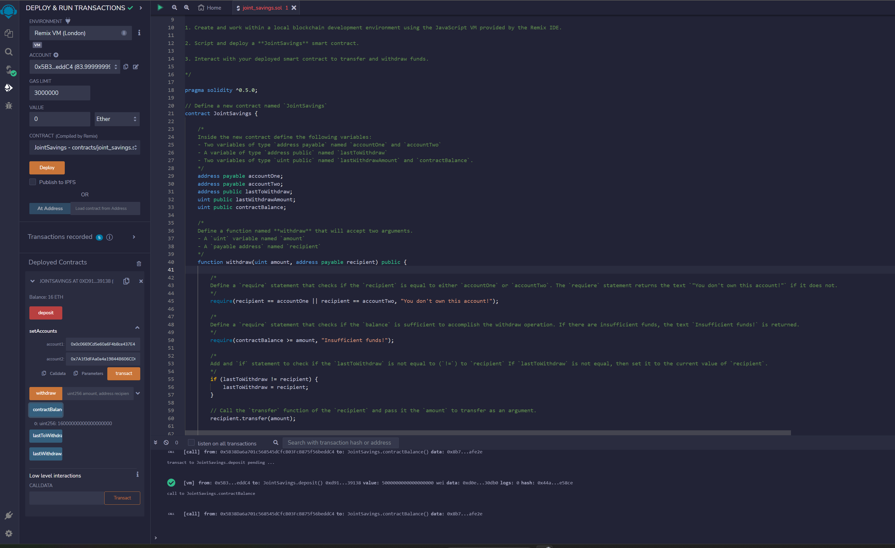

### 5 Ether withdraw completed

The following screenshot shows the screen after successfully withdraw 5 eithers to account1.

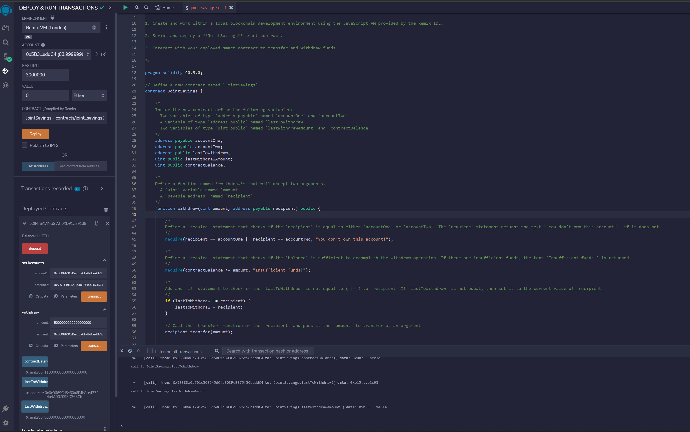

### 10 Ether withdraw completed

The following image shows the screen after withdrawing 10 ethers to account 2 successfully.

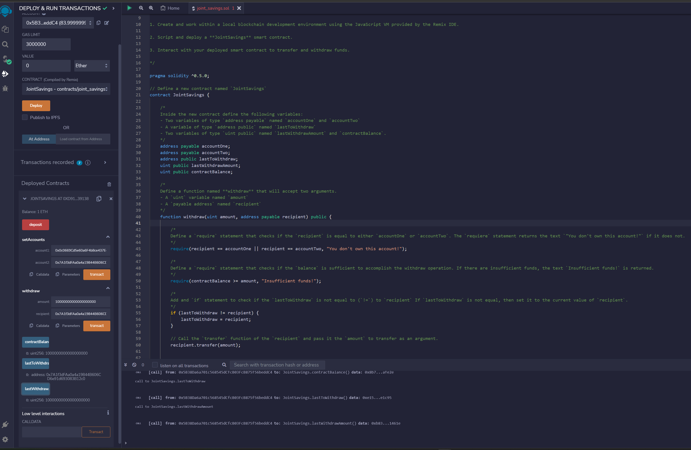

## Converting ether to wei 

The following image shows how the ether to wei conversion has been achieved. 

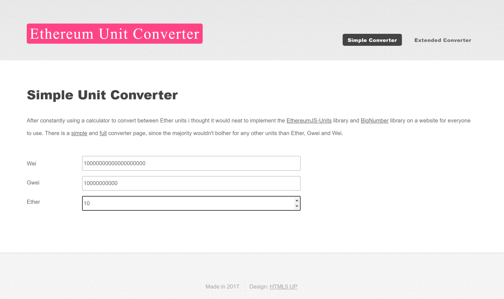